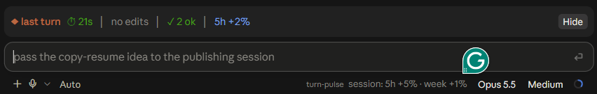
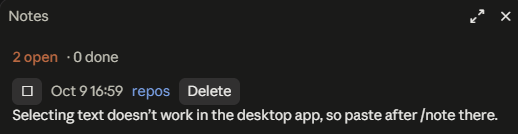

# claude-code-mods

Small mods for [Claude Code](https://claude.com/claude-code), built on its function-hooks plugin API.

| Mod | What it does |
| --- | --- |
| [turn-pulse](plugins/turn-pulse) | A band above the prompt summarizing the last turn, plus a live status line while Claude works. |
| [notes](plugins/notes) | `/note` saves chat text to a notes list shared across projects; `/notes` opens it in a side pane. |
| [sessions](plugins/sessions) | `/sessions` opens a side pane listing the sessions running on this machine and whether each is working or idle. |

> **Early access.** The mod API these use is marked EARLY ACCESS and may change between Claude Code releases. Built and tested on Claude Code 2.1.293, on Windows, in the desktop app's Code tab.

## Install

In a terminal Claude Code session, type one line per mod:

```
/plugin install turn-pulse --marketplace ilya-paskhover/claude-code-mods
```

```
/plugin install notes --marketplace ilya-paskhover/claude-code-mods
```

```
/plugin install sessions --marketplace ilya-paskhover/claude-code-mods
```

Answer `y` to add the marketplace (asked only the first time), then pick a scope. The user scope makes the mod load in every session, including sessions the desktop app starts. `/plugin` is not available inside the desktop app's Code tab, so install from a terminal.

## turn-pulse



A band labeled **◆ last turn** sits above the prompt after each turn:

- **Duration** of the turn, in yellow past 2 minutes.
- **Files edited**, in green. An edit **outside the session's working folder** shows in bold red, with a 15 second toast.
- **Tool results**: `✓ N ok`, and `✗ N failed (Tool ×n)` when something failed.
- **Usage-limit cost** of the turn, for example `5h +1% · week +0.3%`.

The status line shows `▶ Tool · N ok · ✗ N failed` live during a turn, and `session: 5h +6% · week +2%` between turns. A toast appears when a turn takes 60 seconds or more. `/pulse` hides or shows the band.

Limits:

- Usage numbers are account-wide, so other sessions running at the same time count toward them.
- Tracking starts when the mod loads, and the handling of a limit window resetting is heuristic.
- Paths are compared case-insensitively. That is right on Windows but could misjudge an "outside" edit on a case-sensitive Linux file system.

## notes



- `/note <text>` saves the typed text. With text selected in the transcript, `/note <comment>` saves the selection with the typed text as its comment.
- Notes are kept in the mod's own store, shared across all sessions and projects.
- `/notes` opens a **Notes** side pane: notes render as Markdown, long ones fold behind More/Less, and each has a ☐/☑ done toggle, Delete, and Jump (scroll to the message it came from; same session only). Show/Hide done and Clear done act on the whole list.
- Text pasted into the prompt has its `<pasted_content>` wrapper stripped.

Limits:

- In the desktop app the selection is not passed to mods, so `/note` there needs pasted or typed text, and Jump never appears. Selection is documented to work in the fullscreen terminal; I have not verified that. Tracked in [#1](https://github.com/ilya-paskhover/claude-code-mods/issues/1).

## sessions

`/sessions` opens a **Sessions** side pane listing every Claude Code session running on this machine, from any folder:

- A count of running and working sessions, and a Refresh button.
- One row per session: ● **working** (yellow) or ○ **idle** (green), the session's name, how long since its last activity, its folder, and "this session" on your own row.
- Working sessions sort first, then the most recently active.
- The pane refreshes every 5 seconds while it is open and stops when you close it.

Limits:

- The list comes from Claude Code's own files in `~/.claude/sessions/` (or `$CLAUDE_CONFIG_DIR/sessions/`), not from the mod API. That format is undocumented and could change in any release; if no file can be read, the pane says so instead of showing a wrong list.
- Only sessions running on this machine appear. Closed sessions and cloud sessions do not.
- The pane can't switch to another session; it only shows them.
- A session that crashed can leave its file behind. A "working" row with no activity for 30 minutes shows dimmed as "working?".

## Developing

Each mod is a plugin folder under `plugins/`. To run a working copy instead of the installed one, name the folders in the `env` block of `~/.claude/settings.json` (separated by `;` on Windows, `:` elsewhere) and uninstall the marketplace copy so the mod does not load twice:

```json
{
  "env": {
    "CLAUDE_CODE_PLUGIN_DIRS": "/path/to/claude-code-mods/plugins/turn-pulse;/path/to/claude-code-mods/plugins/notes"
  }
}
```

Interactive sessions watch those folders and reload a mod when its files are saved. Checks, per mod folder:

```
claude plugin validate plugins/notes
```

```
claude plugin test plugins/notes
```

Each mod's `tsconfig.json` extends the type declarations the engine writes into `.claude-plugin/types/` when it loads the mod (gitignored), so `tsc -p plugins/notes` works once the mod has loaded once.

## License

[MIT](LICENSE)
